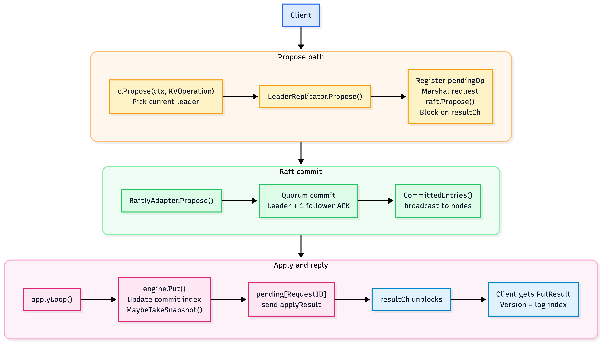
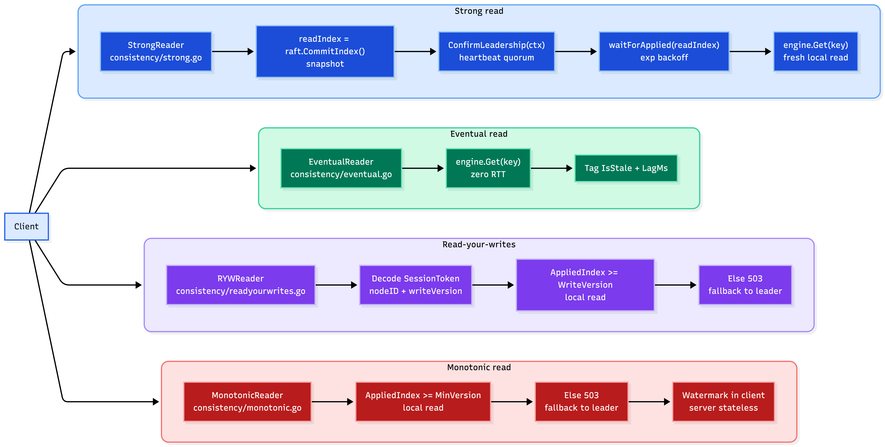
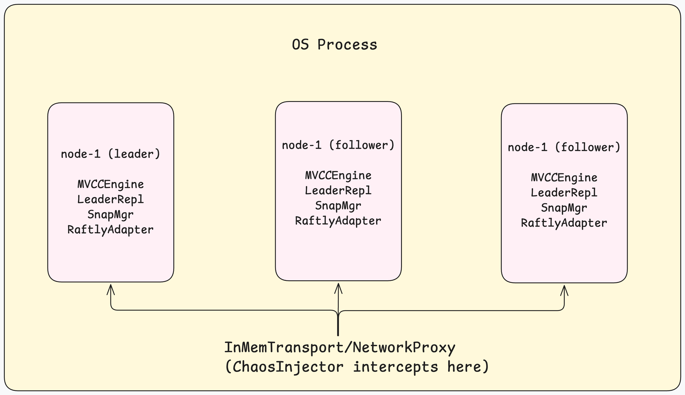
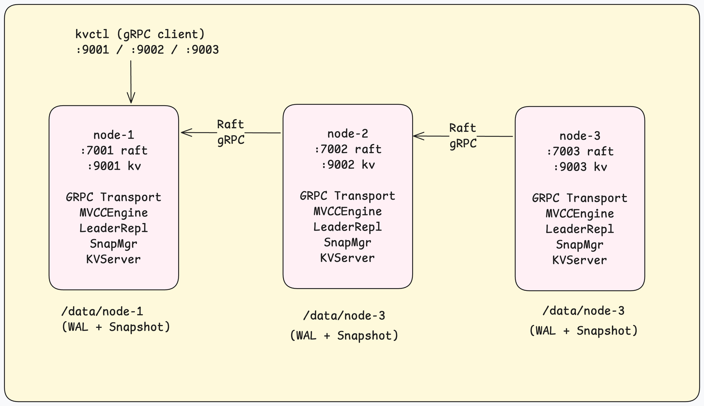
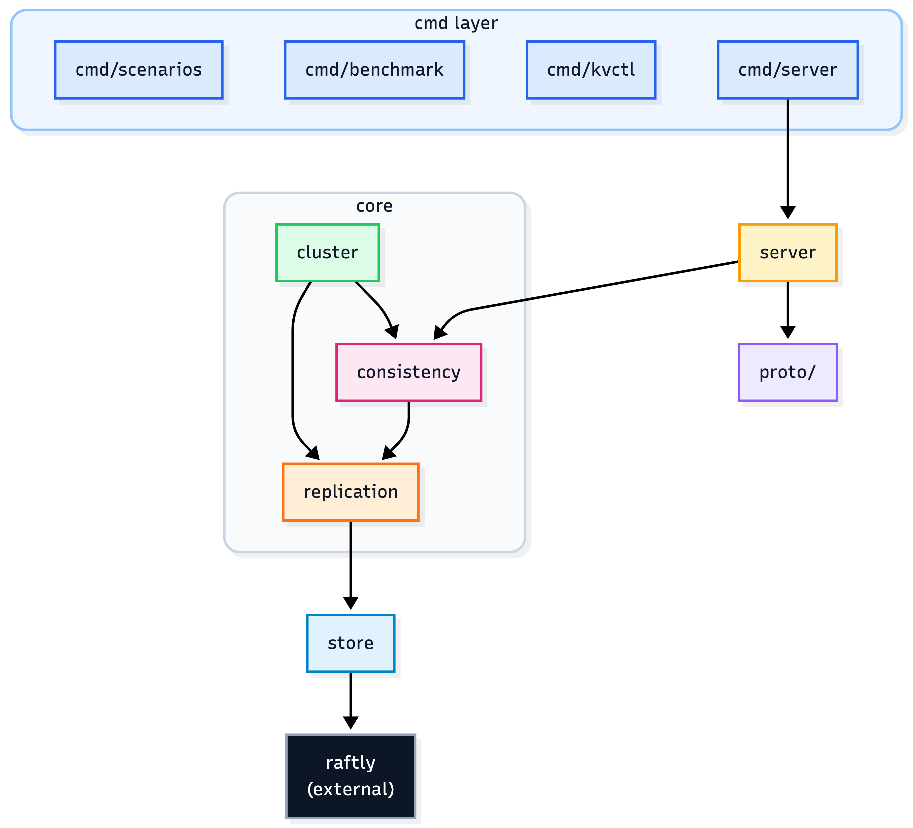

# KV Fabric

When we replicate data across three machines, every read becomes asks this question: _which copy is right?_

The answer depends on what we are willing to pay. A bank balance needs the latest value, always - even if that costs an extra network round-trip. A user's profile picture can be a few hundred milliseconds stale - pay nothing, serve it from the nearest node. Most systems pick one answer and apply it everywhere. That's the wrong call.

**kv-fabric** is a distributed key-value store that makes consistency a per-request choice, with a benchmark harness that measures exactly what each choice costs. The four failure scenarios included are not contrived edge cases. They are the actual production bugs that took down real systems.

---

## The core concept: consistency is a spectrum

When we write a value to this cluster, Raft replicates it to a majority of nodes before returning success. A write is durable: that means a quorum of machines has it, but the other nodes might not have applied it yet. When a client reads that value 50 ms later, what should it see?

***kv-fabric*** answers this question four ways, and lets us measure the trade-off of each:

| Mode               | The guarantee       | The plain-English version                                                          | What it costs                                                                |
| ------------------ | ------------------- | ---------------------------------------------------------------------------------- | ---------------------------------------------------------------------------- |
| `strong`           | Linearizable        | We always see the most recent write, period                                       | One Raft round-trip per read: the leader must confirm it's still the leader  |
| `eventual`         | Best-effort         | We might see data that's a few hundred milliseconds stale                         | Nothing: read from the nearest node, zero network overhead                  |
| `read-your-writes` | Session consistency | We always see our own writes; others might see an older version                  | Nothing on a caught-up follower; one round-trip if we land on a lagging one |
| `monotonic`        | Monotonic reads     | Time never goes backward - we will never see version 5 after we have seen version 10 | Nothing on a caught-up follower; one round-trip to the leader otherwise      |

The benchmark (`make bench`) runs all four modes across five workloads and four concurrency levels and produces a table of ops/sec, $p50/p99$ latency, and stale-read percentage. The numbers are real - the cluster is real, the Raft consensus is real, the only thing missing is network latency.

---

## Four failure modes, four lessons

These scenarios are runnable. Each one starts a real in-process Raft cluster, injects a real failure, and prints the evidence. If we Run them in order, each one teaches a different lesson about what goes wrong when we get consistency wrong.

### 1. The phantom write (`make scenario-phantom`)

**Failure**: We write a value. The server says "success." We crash the server. The value never existed.

This is the semi-synchronous replication trap. "Semi-sync" means: wait for at least one follower to acknowledge before returning success. The problem is the fallback. If no follower responds within the timeout, the leader returns success anyway  because blocking forever is worse than losing data. At that moment, the write exists only on the leader's log. If the leader crashes before a follower catches up, the write is gone.

The scenario sets the semi-sync timeout to 10 ms (shorter than the follower lag polling interval), writes a key, crashes the leader, waits for a new leader to be elected, and reads the key. It's gone. `kv_fabric_semisync_fallback_total` and `kv_fabric_phantom_writes_total` Prometheus counters show exactly when and how often this happens.

**Lesson**: `fallbackCount > 0` in our metrics when a leader dies is a guarantee of data loss. If our durability requirement is absolute, we need synchronous replication, not semi-sync with a fallback.

### 2. The double-booking (`make scenario-booking`)

**Failure**: Two users book the last seat on a flight. Both get confirmation emails. The plane is oversold.

This happens when we read availability from a follower that hasn't caught up to the latest writes. The scenario injects 340 ms of artificial lag on one follower's replication stream, then issues two concurrent seat-booking reads from that follower. Both see `seats=1`. Both book. Inventory drops to `seats=-1`.

The scenario demonstrates two fixes, and both are valid:

- **Fix A - strong reads**: Route the availability check to the leader with `ConsistencyStrong`. The leader confirms it is still the leader before reading, so it always sees the latest inventory.
- **Fix B - optimistic concurrency**: Use `PutOptions{IfVersion: v}`. The second booking fails with a version conflict (someone else already changed the inventory) and retries. This works without touching the leader as the storage engine enforces it.

**Lesson**: eventual consistency is correct for many use cases, but "does this seat exist?" is not one of them. The right fix is not "use strong everywhere" but to "use strong where staleness has real consequences."

### 3. The MVCC memory leak (`make scenario-mvcc-bloat`)

**Failure**: A long-running analytics query slowly freezes our garbage collector. Memory climbs until the process OOMs.

MVCC (Multi-Version Concurrency Control) works by keeping old versions of data alive instead of overwriting them. This is what enables consistent snapshot reads: a transaction that started at version 100 will always see the world as it was at version 100, even as newer writes accumulate. But if a transaction holds its snapshot open indefinitely, the garbage collector cannot reclaim anything newer than that snapshot. Memory grows without bound.

The scenario shows the three-phase lifecycle: accumulate 500 versions of a hot key -> an analytics transaction pins version 300 -> the GC horizon freezes at 300 even as the commit index advances to 490 -> the analytics job finishes, unpins -> GC reclaims 300–489 in one pass.

`kv_fabric_mvcc_gc_blocked=1` is the production signal. `TotalVersions / TotalKeys` is the bloat ratio to alert on.

**Lesson**: MVCC is not free. The price is that long-running transactions hold old versions hostage. Every storage system that uses MVCC (Postgres, MySQL InnoDB, CockroachDB) has this problem. The fix is a maximum transaction age with a hard timeout.

### 4. The dirty read (`make scenario-dirty-read`)

**Failure**: A money transfer moves $200 from Alice to Bob. A concurrent reader catches Alice's account debited but Bob's not yet credited. $200 has temporarily vanished from the world.

Without snapshot isolation, a reader between two writes in the same logical operation sees intermediate state. The scenario transfers $200 across two accounts and reads both in between. Without isolation: Alice has $800, Bob has $1000, total is $1800 instead of $2000. $200 is missing.

With MVCC snapshot isolation (`GetAtVersion`), the reader pins the pre-transfer version. No matter when it reads, it sees Alice at $1000 and Bob at $1000. The total is always $2000.

**Lesson**: transactions exist to make multi-write operations appear atomic to readers. MVCC implements this without locking, readers and writers never block each other, because each version of a value is immutable once written.

---

## How it is built

### Write path



Every write goes through the Raft leader. The leader appends it to the distributed log, waits for a quorum of nodes to acknowledge it (that's the durability guarantee), then applies it to the local storage engine. Every follower applies the same entry in the same order.

The most important design decision is that **the Raft log index is the MVCC version number**. Entry at index 5000 is version 5000, on every node, always. This eliminates the need for a separate version counter, a distributed ID generator, or any coordination. Same inputs, same order, same version - that's what makes the state machine consistent.

### Read path (per consistency mode)



Writes always go to the leader. Reads go wherever the consistency mode allows. Strong reads require a heartbeat quorum (expensive). Eventual reads are purely local (free). RYW and monotonic reads are local when the node is caught up, and fall back to the leader when it isn't - this is the "pay nothing on the happy path" property that makes session consistency practical.

### Cluster topology

**In-process (scenarios and benchmarks)**



Scenarios and benchmarks use an in-process cluster: three Raft nodes in one OS process, communicating over Go channels instead of a network. This is not a simulation: the Raft leader election, log replication, and commit quorum are all real. `ChaosInjector` intercepts messages at the transport layer and injects drops, delays, and partitions. The numbers are real; only the network RTT is absent.

**Networked (`make cluster-start` / `make docker-cluster-start`)**



The `cmd/server` binary runs as a real network process. Three nodes communicate over gRPC: one port for inter-node Raft (`--raft-addr`), one for client traffic (`--kv-addr`). `kvctl` is the CLI client: it connects to any node and follows redirects to the leader automatically.

Non-leader nodes return a `redirect_to` address in the gRPC response. The client follows the redirect and retries. There is no internal server-to-server forwarding - every hop is visible in client logs and latency is attributable to the correct node.

---

## Package structure



Lower packages never import upper ones. `store` knows nothing about Raft. `replication` knows nothing about HTTP or gRPC. This keeps each layer independently testable.

### `store/` - Multi-version storage engine

The storage layer implements one contract:

```go
type KVEngine interface {
    Put(key string, value []byte, opts PutOptions) (*PutResult, error)
    Get(key string, opts GetOptions) (*GetResult, error)
    Delete(key string, opts DeleteOptions) error
    Scan(start, end string, limit int) ([]KVPair, error)
    Snapshot() (Snapshot, error)
    ApplySnapshot(Snapshot) error
    Stats() EngineStats
    Close() error
}
```

`MVCCEngine` keeps every write as a new `Version` in the key's chain. Old versions are never overwritten in place. This is what prevents dirty reads and enables point-in-time reads. GC runs on a configurable interval and reclaims versions older than `min(replicationHorizon, oldestActiveTransactionPin)`.

### `replication/` - Raft integration and log compaction

| File                  | What it does                                                                   |
| --------------------- | ------------------------------------------------------------------------------ |
| `leader.go`           | Proposes writes to Raft; wakes client goroutines when their entry is committed |
| `follower.go`         | Applies the same committed entries on non-leader nodes                         |
| `snapshot_manager.go` | Periodically saves engine state to disk; restores it on startup                |
| `semisync.go`         | Optionally waits for a follower ACK; counts timeouts as fallbacks              |
| `lag.go`              | Tracks how far each follower is behind the leader                              |
| `raftly_adapter.go`   | Adapts the external raftly library to kv-fabric's `RaftNode` interface         |

**Log compaction**: without snapshots, a restarting node must replay every Raft entry ever committed to reconstruct its state. A node that has processed one million entries would take seconds to restart. `SnapshotManager` solves this by periodically serializing the engine's current state to disk. On startup, the node loads the snapshot first (fast), then replays only the entries that arrived after the snapshot was taken (a small delta). Snapshots use a temp-file → rename two-phase write: `os.Rename` is atomic on POSIX, so a crash mid-write always leaves the previous snapshot intact.

### `consistency/` - Read routing

`Router.Get()` dispatches each read to the right reader based on the consistency mode. The router never touches Raft directly - it delegates to four focused reader types:

- **`StrongReader`**: takes the current commit index, sends a heartbeat quorum to confirm leadership, waits for applied ≥ commit index, reads local engine
- **`EventualReader`**: reads local engine, tags result with `IsStale=true` and `LagMs` if the node is behind
- **`RYWReader`**: decodes a session token (base64 JSON: `{nodeID, writeVersion}`), checks `appliedIndex ≥ writeVersion`, reads local or falls back to leader
- **`MonotonicReader`**: checks `appliedIndex ≥ opts.MinVersion` (a client-side watermark), reads local or falls back to leader

### `server/` - HTTP REST and gRPC APIs

Two independent APIs on the same node:

**HTTP REST:** used by the in-process cluster and direct HTTP clients

| Endpoint                   | Method | Notes                                                  |
| -------------------------- | ------ | ------------------------------------------------------ |
| `/v1/keys/{key}`           | PUT    | Returns `session_token` for subsequent RYW reads       |
| `/v1/keys/{key}`           | GET    | Consistency via `X-Consistency` header                 |
| `/v1/keys`                 | GET    | Range scan: `?start=&end=&limit=`                      |
| `/v1/status`               | GET    | Node state, commit index, replication lag per follower |
| `/v1/debug/gc`             | GET    | GC horizon, blocked-by-txn flag, cycle count           |
| `/metrics` (separate port) | GET    | Prometheus text format                                 |

**gRPC:** used by `cmd/server` and `kvctl`

```protobuf
service KVFabric {
    rpc Put(PutRequest)       returns (PutResponse);    // redirect_to if not leader
    rpc Get(GetRequest)       returns (GetResponse);    // redirect_to on ErrNotCaughtUp
    rpc Delete(DeleteRequest) returns (DeleteResponse);
    rpc Scan(ScanRequest)     returns (ScanResponse);
    rpc Status(StatusRequest) returns (StatusResponse);
}
```

**Prometheus metrics**

| Metric                              | Type      | What to alert on                                                |
| ----------------------------------- | --------- | --------------------------------------------------------------- |
| `kv_fabric_semisync_fallback_total` | counter   | > 0 means writes may be lost if the leader crashes now          |
| `kv_fabric_phantom_writes_total`    | counter   | > 0 means data loss has already occurred                        |
| `kv_fabric_replication_lag_ms`      | gauge     | > 500 ms means stale-read risk is high                          |
| `kv_fabric_mvcc_gc_blocked`         | gauge     | = 1 means memory is growing; find the stuck transaction         |
| `kv_fabric_mvcc_versions_total`     | gauge     | `versions / keys > 10` is a bloat signal                        |
| `kv_fabric_stale_reads_total`       | counter   | Baseline for how often eventual reads are actually stale        |
| `kv_fabric_op_duration_ms`          | histogram | p99 spike on `strong` reads = leader is under election pressure |

---

## Interesting engineering problems encountered

These are bugs that were real, not hypothetical. They showed up while building this.

**The pre-registration race** (`replication/leader.go`): [raftly](https://github.com/ani03sha/raftly)'s commit channel is buffered. A committed entry can arrive at the apply loop _before_ `raft.Propose()` returns to the caller. If the pending-op map entry is registered after `Propose()`, the apply loop processes the entry, finds no pending op, and the client times out. 
*Fix:* register the pending op with `fmt.Sprintf("%p", resultCh)` as the key _before_ calling `Propose()`. The channel pointer is unique per proposal for the process lifetime — no coordination needed.

**The deadlock** (`replication/leader.go`): calling `raft.Propose()` while holding `pendingMu` causes the apply loop to block on `pendingMu.Lock()` inside `applyEntry`. The client's context deadline fires and tries to re-acquire the same lock on the same goroutine - permanent deadlock, zero CPU, zero output. Go's `sync.Mutex` is not reentrant. Always release locks before calling into another subsystem.

**The snapshot version bug** (`store/snapshot.go`): snapshots use `gcHorizon` as their version number: the point up to which garbage collection has run. But GC runs on a 10-minute ticker. A node that crashes before GC fires would store snapshot version 0, then replay the entire Raft log from index 0 on restart. Fix: snapshot version = `max(gcHorizon, highest live entry version)`. The highest live version is the actual applied index for the state we captured.

---

## Getting started

### Prerequisites

- Go 1.21+
- Docker (for `make docker-*`)
- GNU Make

### Build everything

```bash
make build
# Produces: bin/scenarios  bin/benchmark  bin/kvctl  bin/server
```

### See the failure scenarios

```bash
make scenarios              # run all four in sequence (~2 minutes)
make scenario-phantom       # just the phantom write
make scenario-booking       # just the double-booking
make scenario-mvcc-bloat    # just the memory bloat
make scenario-dirty-read    # just the dirty read
```

### Run the benchmark

```bash
make bench
# 80 runs × 3 seconds = ~4 minutes
# Prints ops/sec, p50/p99 latency, stale-read% for each combination
```

### Run the tests

```bash
make test        # integration: real 3-node clusters with -race detector
make test-unit   # unit: store/, replication/, consistency/ in isolation
```

### Start a live cluster

```bash
make cluster-start
# Three nodes start in the background on localhost:
#   node-1  raft=:7001  kv=:9001
#   node-2  raft=:7002  kv=:9002
#   node-3  raft=:7003  kv=:9003

./bin/kvctl put mykey myvalue --nodes localhost:9001,localhost:9002,localhost:9003
./bin/kvctl get mykey         --nodes localhost:9001,localhost:9002,localhost:9003
./bin/kvctl status            --nodes localhost:9001,localhost:9002,localhost:9003

make cluster-stop    # graceful shutdown
make cluster-clean   # shutdown + delete WAL data
```

When a node restarts, it loads its most recent snapshot from disk first, then replays only the Raft log entries that arrived after the snapshot. A node with 50 000 committed entries recovers in milliseconds, not seconds.

### Start a containerised cluster

```bash
make docker-build          # build the image (do this first)
make docker-cluster-start  # three containers, ports 9001-9003 on host
make docker-cluster-stop   # keep volumes
make docker-cluster-clean  # delete volumes too
```

---

## Benchmark interpretation

`make bench` prints a Markdown table. Key things to look for:

**Consistency mode does not affect write throughput.** Mode is a read-side contract. All four modes produce identical ops/sec on `write-only` workloads because every write goes through the same Raft propose path regardless.

**The `ReadIndex` tax is measurable.** In `read-heavy` workloads, `strong` mode issues a heartbeat quorum for every read. On a real network with 1–5 ms RTT this becomes the dominant cost. The in-process benchmark shows a smaller gap because channel latency is sub-millisecond.

**RYW and monotonic converge with strong under write pressure.** When writes are fast enough to keep followers perpetually behind, every RYW/monotonic read falls back to the leader (the client's watermark always exceeds the follower's applied index). Throughput matches strong. This is correct behavior — the modes fail-safe rather than serving stale data below the client's guaranteed version.

**`stale%` is the cost of eventual.** In `write-heavy` workloads, eventual reads have the highest stale rate and the widest `LagMs` range. This is the number to show your product team when they ask "how stale is eventual, really?"

---

## Dependencies

| Package                               | Version  | Role                                                      |
| ------------------------------------- | -------- | --------------------------------------------------------- |
| `github.com/ani03sha/raftly`          | v0.2.0   | Raft consensus: elections, log replication, commit quorum |
| `go.uber.org/zap`                     | v1.27.1  | Structured logging                                        |
| `github.com/prometheus/client_golang` | v1.23.2  | Metrics                                                   |
| `github.com/spf13/cobra`              | v1.10.2  | `kvctl` CLI                                               |
| `google.golang.org/grpc`              | v1.80.0  | Client-facing KV API and inter-node Raft transport        |
| `google.golang.org/protobuf`          | v1.36.11 | Protocol Buffers                                          |
